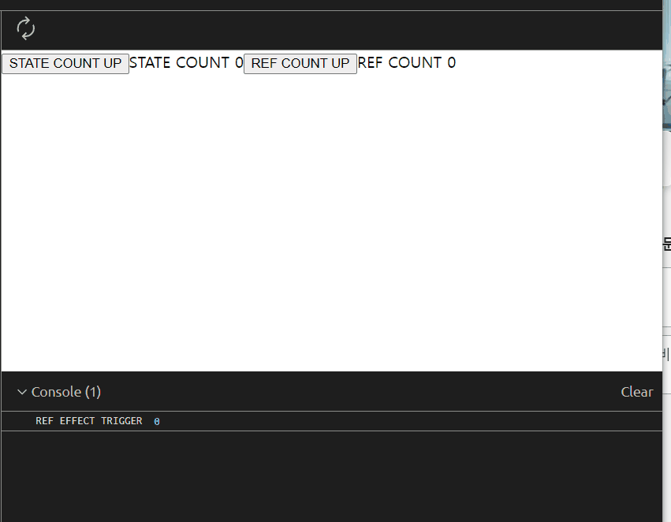
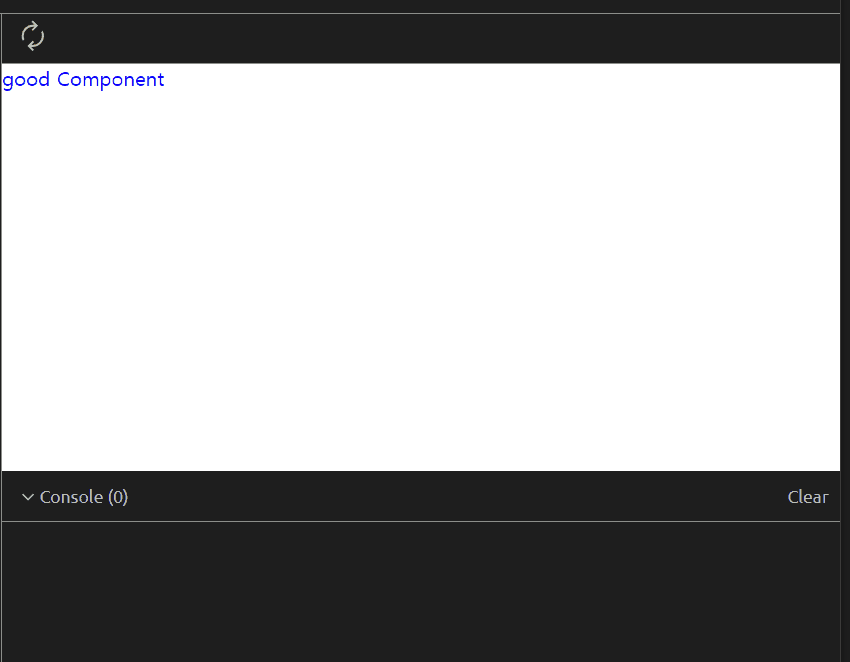
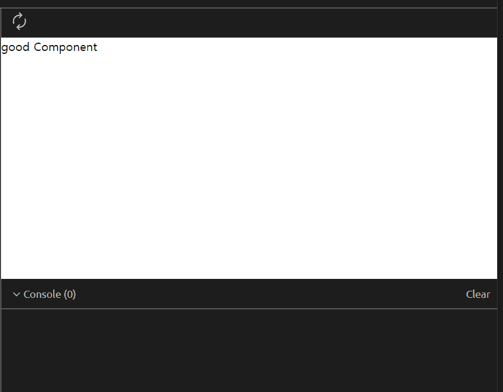

최근 동료 분이 useEffect의 의존성 배열에는 useRef의 값이 들어가면 안된다고 코드 리뷰를 해주셨다. 하지만 분명 useRef의 current값이 들어갈 때와 안 들어갈 때가 차이가 있었다. 그 차이를 인식하고 해당 방법으로 구현을 했기에 혼란스러웠다. 아래 예제를 보자

### useRef 값을 의존성 배열을 넣으면 분명 차이가 있긴하다

```jsx
import React, { useState, useRef, useEffect } from "react";

const App = () => {
  const [count, setCount] = useState(0);
  const countRef = useRef(0);

  useEffect(() => {
    console.log("REF EFFECT TRIGGER", countRef.current);
  }, [countRef.current]);

  return (
    <div>
      <button onClick={() => setCount(count + 1)}> STATE COUNT UP </button>
      <span>STATE COUNT {count}</span>
      <button
        onClick={() => {
          countRef.current += 1;
        }}
      >
        {" "}
        REF COUNT UP{" "}
      </button>
      <span>REF COUNT {countRef.current}</span>
    </div>
  );
};

export default App;
```



```jsx

import React, { useState, useRef, useEffect } from 'react'

const App = () => {
...

  useEffect(() => {
    console.log("REF EFFECT TRIGGER", countRef.current)
  }, [])

...
}

export default App


```


위 예제와 같이 useRef를 의존성 배열에 넣은 경우에는 다른 trigger에 의해 해당 컴포넌트가 재호출 되었을 때 useRef를 의존성 배열에 넣은 effect가 실행이 된다. 반면, 의존성 배열에 넣지 않은 effect는 실행되지 않는다. 분명 동작의 차이는 있다. 하지만 이것은 React가 바라지 않는 사이드 이펙트다.

React는 Hook의 의존성 배열에 다시 렌더링을 trigger시키는 값만 넣도록 권고하고 있다. 화면을 그리는데 있어서 큰 이슈를 유발 하는 것은 아니라 Error는 내보내고 있지 않지만 추적되기 어려운 사이드 이펙트를 만들 수 있기 때문에 trigger를 유발하지 않는 값을 의존성 배열에 넣는 것은 지양하도록 권하고 있다.

### 그럼에도 useRef 값을 의존성 배열에 넣고 싶은 경우에는 어떻게 할까

```jsx
import React, { useState, useRef, useEffect } from "react";

const fakeAPICall = () =>
  new Promise((resolve) => {
    setTimeout(resolve, 1000);
  });

const App = () => {
  const [state, setState] = useState(null);
  const [title, setTitle] = useState("");
  const ref = useRef(null);

  useEffect(() => {
    // 1. 데이터를 호출하고 state에 넣기
    fakeAPICall().then(() => {
      setState({
        data: "good",
      });
    });
  }, []);

  useEffect(() => {
    // 3 ref.current가 있다면 스타일 변경하기
    if (ref.current) {
      ref.current.style.color = "blue";
    }
  }, [ref.current]);

  useEffect(() => {
    // 2. state가 있다면 title에 넣기
    if (state) {
      setTitle(`${state.data} Component`);
    }
  }, [state]);

  return <div>{state && <div ref={ref}> {title} </div>}</div>;
};

export default App;
```



위의 예제 같은 경우에는 ref.current가 의존성 배열에 있어야 원하는 사이드 이펙트가 생기는 예제이다. setState -> setTitle -> ref.current 변경으로 이어지는 과정으로 API호출이 완료되고 title이 설정되면 스타일 변경을 해서 원하는 렌더를 만들어낸다. 의존성 배열에 없다면 아래와 같이 style이 바뀌지 않는다.



이를 리액트가 권고하는 방법으로 다시 써보자 간단히 useRef 쓰는 부분을 재호출을 trigger하는 useState로 바꿔서 쓰면 된다.

setState 함수를 컴포넌트에 ref props에 넣으면 해당 컴포넌트가 mount될때 ref에 있는 콜백을 호출해준다. 간단하게 setState 함수만 전달해도 좋다

```jsx

import React, { useState, useRef, useEffect } from 'react'

...

const App = () => {
  const [state, setState] = useState(null);
  const [title, setTitle] = useState('');
  const [ref, setRef] = useState(null)

  useEffect(() => { // 1. 데이터를 호출하고 state에 넣기
    fakeAPICall().then(() => {
      setState({
        data: 'good'
      })
    })
  }, [])

  useEffect(() => { // 2. ref가 있다면 스타일 변경하기
    if(ref){
      ref.style.color = 'blue'
    }
  }, [ref])

  useEffect(() => { // 2. state가 있다면 title에 넣기
    if(state){
      setTitle(`${state.data} Component`)
    }
  }, [state])


  return (
    <div>
      {
        state && (<div ref={setRef}> {title} </div>)
      }
    </div>
  )
}

export default App

```

### react-hooks eslint룰을 사용하자

해당 사이드 이펙트는 에러를 유발하지 않기 때문에 개발 중에 헤당 상황을 피하려면 eslint 룰에 추가가 필요하다. 나의 실수가 작성중이 아닌 코드 리뷰에서 발견된 것도 react-hook eslint 룰을 설정 해놓지 않기 때문에 그렇게 되었다. 해당 룰을 사용하게 되면 useRef값을 의존성 배열로 쓰게 되었을 때 react-hooks/exhaustive-deps 경고 혹은 에러 (설정에 따라 다르다) 를 만날 수 있을 것이다.

### 정리

- React Hook의 의존성 배열에는 재렌더를 유발하는 상태만 넣자
- 리액트에서 직접적으로 에러는 내지 않기 때문에 eslint룰로 막아볼 수 있다
